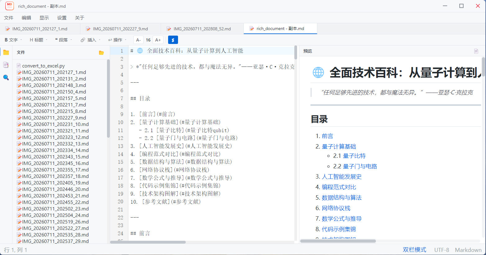

<div align="center">

# MdEv

**一款轻量、高效的本地 Markdown 编辑器**

Markdown Editor for Windows — 左编辑右预览双栏布局，支持工程目录管理、全文搜索、目录导航、数学公式、图表渲染、主题个性化及多格式导出。

[](https://www.apache.org/licenses/LICENSE-2.0)
[](https://github.com/wrrgit/MdEv)
[](https://www.electronjs.org/)
[](https://vuejs.org/)
[](https://github.com/wrrgit/MdEv/releases)

[English](./README.en.md) | 简体中文

</div>

---

## 介绍

MdEv 是一款基于 Electron + Vue 3 + CodeMirror 6 构建的 Windows 桌面端 Markdown 编辑器。它开箱即用，无需联网，所有文件操作均在本地完成，适合日常写作、技术文档编写、笔记整理等场景。

### 为什么选择 MdEv？

- **纯本地** — 所有文件操作在本地完成，数据不离开你的电脑，隐私安全有保障
- **所见即所得** — 左编辑右预览实时同步，滚动联动，写作体验流畅
- **功能完备** — 内置数学公式、代码高亮、Mermaid 图表、目录导航、全文搜索
- **开箱即用** — 下载即用，无需配置环境，也无需联网

## 界面预览

<div align="center">
软件首页


支持打开文件夹


</div>

## 功能特性

- **CodeMirror 6 编辑器** — 语法高亮、搜索替换、括号匹配、代码折叠
- **实时预览** — markdown-it 渲染 + KaTeX 数学公式 + highlight.js 代码高亮 + Mermaid 图表
- **工程目录管理** — 打开整个文件夹作为项目，文件树浏览 / 新建 / 删除 / 重命名
- **多标签页** — 拖拽排序、未保存标记、右键菜单关闭
- **全文搜索** — 文件内搜索 (`Ctrl+F`) + 跨文件搜索 (`Ctrl+Shift+F`)，预览区同步高亮
- **目录导航** — 自动提取标题树，点击跳转章节，滚动自动高亮当前章节
- **个性化主题** — 跟随系统 / 浅色 / 深色；自定义字体、字号、行高；支持导入本地字体
- **自动保存** — 防抖自动写盘，状态栏实时显示保存状态
- **导出分享** — 导出为 PDF、HTML，公式与样式完整保留
- **撤销 / 重做** — 完整编辑历史
- **最近文件** — 最近文件 / 文件夹快速访问，支持置顶和拖拽排序
- **自动换行** — 可切换软换行模式，适配长文写作

## 下载安装

### 方式一：直接下载（推荐普通用户）

前往 [Releases 页面](https://github.com/wrrgit/MdEv/releases) 下载最新版本的 `MdEv-Setup-0.1.0.exe`，双击即可安装运行。

> 也可下载便携版 `MdEv 0.1.0.exe`，无需安装，双击即用。

### 方式二：从源码构建

适合开发者或希望自行编译的用户。

#### 环境要求

- Node.js ≥ 18（推荐 20 LTS）
- npm ≥ 9

#### 步骤

```bash
# 克隆仓库
git clone https://github.com/wrrgit/MdEv.git
cd MdEv

# 安装依赖
npm install

# 开发模式（Electron + Vite HMR）
npm run electron:dev

# 打包为 Windows 安装包（NSIS）
npm run make

# 或打包为便携版（portable）
npm run package
```

打包产物位于 `release/` 目录下。

## 快捷键

| 快捷键 | 功能 |
|--------|------|
| `Ctrl + N` | 新建文件 |
| `Ctrl + O` | 打开文件 |
| `Ctrl + Shift + O` | 打开文件夹 |
| `Ctrl + S` | 保存 |
| `Ctrl + Shift + S` | 另存为 |
| `Ctrl + F` | 文件内查找 |
| `Ctrl + Shift + F` | 跨文件搜索 |
| `Ctrl + G` | 跳转到行 |
| `Ctrl + B` | 切换侧栏 |
| `Ctrl + ,` | 打开设置 |

## 技术栈

| 层级 | 技术 |
|------|------|
| 桌面壳 | Electron 33 |
| UI 框架 | Vue 3 (Composition API) |
| 构建工具 | Vite 5 |
| 状态管理 | Pinia |
| 代码编辑器 | CodeMirror 6 |
| Markdown 解析 | markdown-it |
| 数学公式 | KaTeX |
| 代码高亮 | highlight.js |
| 图表渲染 | Mermaid |
| 安全过滤 | DOMPurify |
| 样式基础 | github-markdown-css |

## 项目结构

```
MdEv/
├── electron/               # Electron 主进程
│   ├── main.js             # 窗口管理、菜单、应用生命周期
│   ├── preload.cjs         # 安全桥接（Context Isolation）
│   └── ipc/                # IPC 处理器
│       ├── fileHandlers.js       # 文件读写、目录树、文件监听
│       ├── searchHandlers.js     # 跨文件全文搜索
│       ├── exportHandlers.js     # PDF / HTML 导出
│       └── settingsHandlers.js   # 设置持久化、窗口控制
├── src/                    # 渲染进程（Vue 3）
│   ├── components/         # UI 组件
│   │   ├── TitleBar.vue          # 自定义标题栏
│   │   ├── MenuBar.vue           # 菜单栏
│   │   ├── TabBar.vue            # 标签页
│   │   ├── Toolbar.vue           # 工具栏
│   │   ├── FileTree.vue          # 文件树
│   │   ├── EditorPane.vue        # 编辑器面板
│   │   ├── PreviewPane.vue       # 预览面板
│   │   ├── PanelSidebar.vue      # 侧栏（目录/搜索）
│   │   ├── SettingsPanel.vue     # 设置面板
│   │   ├── ExportDialog.vue      # 导出对话框
│   │   ├── StatusBar.vue         # 状态栏
│   │   └── WelcomePage.vue       # 欢迎页
│   ├── composables/       # 组合式函数
│   ├── core/              # Markdown 解析核心
│   ├── stores/            # Pinia 状态管理
│   ├── config/            # 工具栏配置
│   └── styles/            # CSS 变量主题
├── build/                  # 应用图标资源
├── assets/                 # 图标素材
├── docs/                   # 项目文档
├── package.json
├── vite.config.js
└── README.md
```

## 版本规划

| 版本 | 目标 | 状态 |
|------|------|------|
| v0.1.0 | MVP 核心编辑器 + 预览 + 基础导出 | ✅ 已发布 |
| v0.2.0 | 工程管理增强 + 多标签优化 | 🚧 规划中 |
| v0.3.0 | 导航 + 搜索体验优化 | 📋 计划中 |
| v0.4.0 | 导出功能扩展 | 📋 计划中 |
| v0.5.0 | 个性化设置完善 | 📋 计划中 |
| v1.0.0 | 正式发布 | 📋 计划中 |

详见 [ROADMAP.md](./docs/ROADMAP.md)。

## 贡献

欢迎提交 Issue 和 Pull Request！

提交前请确保：

1. 遵循 [Conventional Commits](https://www.conventionalcommits.org/) 规范
2. 代码风格与现有代码保持一致
3. 更新相关文档

## 许可证

本项目基于 [Apache License 2.0](./LICENSE) 开源。

Copyright © 2026 [wrrgit](https://github.com/wrrgit)

---

<div align="center">

如果这个项目对你有帮助，欢迎 ⭐ Star 支持！

</div>
